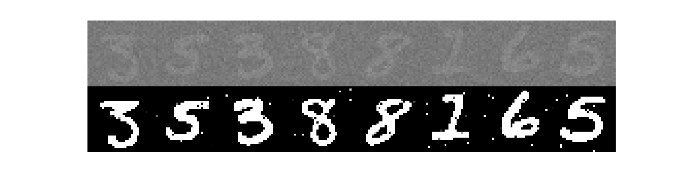
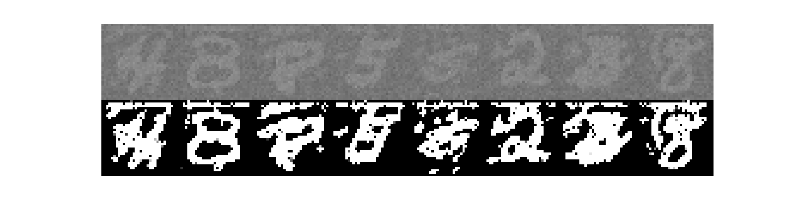
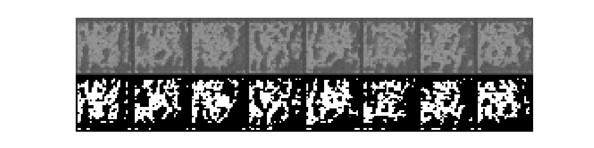

# Graphs

Place graphs here that help visualize the process to guide understanding and debugging.

-   SDE process Desmos plot - [website](https://www.desmos.com/calculator/rjkzmwuny0)

We have previously seen bad performance when it comes to later steps in sampling. In particular, it appears to over transform the images around 75% of the way through sampling (e.g., 750/1000 steps). Consider steps \~650 versus \~800 versus 1000 (sample on top, scores on bottom):

Note that above, the images are from different sampling runs, but the same behaviour is exhibited run to run. A full sample run is as follows:

  

We can also obtain ok results if we cut off the sampling process part way (around step 700-750):

  

Interestingly, we also observe that if we sample from out of the training time bounds, i.e, outside of`[t_min, t_max]` we no longer have the same poor sampling behaviour as above. We are unsure of why this is the case.

  

